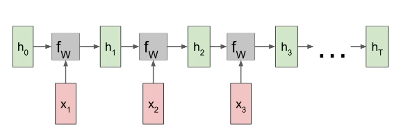

# Recurrent Neural Networks

We can process a sequence of vectors **x** by applying a recurrence formula at every time step:

$$ h_t = f_W(h_{t-1}, x_t) $$

Where:
- **h_t** new state
- **x_t** input vector at some time step 
- **f_W** some function with parameters W
- **h_{t-1}** previous state

Notice: the same function and the same set of parameters are used at every time step

Majority of the lecture was spent on RNNs for text-based data and there was not so much I could write here.

