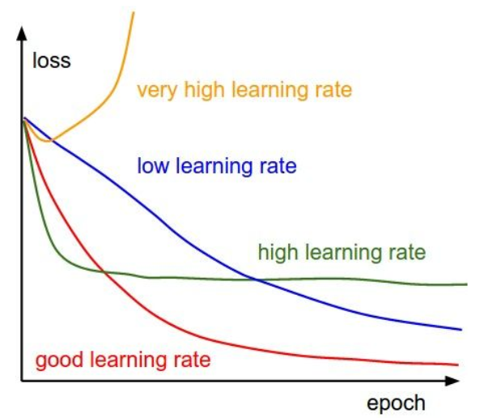
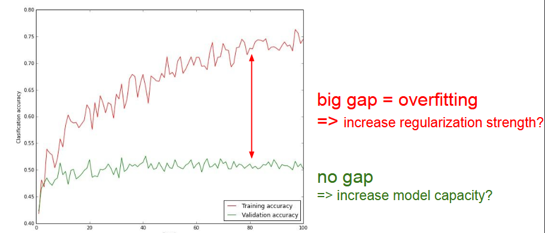

Assignment 2 is out, need to do it!

# Training Neural Networks Part-1

## Overview
1. **One time setup**: activation function, preprocessed, weight initialization, regularization, gradient checking.
2. **Training dynamics**: babysitting the learning process, parameter updates, hyperparameter optimization.
3. **Evaluation**: Model ensembles.

## In Part1
- Activation functions
- Data Preprocessing
- Weight initialization
- Batch Normalization
- Babysitting the learning process
- Hyperparameter optimization

### Activation Functions

1. Sigmoid: $ \sigma(x) = \frac{1}{1+e^{-x}} $

2. tanh: $ \tanh(x) $

3. ReLU: $ max(0, x) $

4. Leaky ReLU: $ max(0.1x, x) $

5. Maxout: $ max(w_1^{t}x + b_1, w_2^{t}x + b_2) $

6. ELU: $\begin{cases} x & \text{if } x > 0 \\ \alpha(e^x -1) & \text{if } x \le 0 \end{cases} $


#### Sigmoid:
- Squashes numbers to range[0,1]
- Historically popular since they have nice interpretation as a saturating "firing rate" of a neuron.
- 3 problems:
    1. Saturated neurons can kill of gradients.
    2. Sigmoid outputs are not zero-centered.
    3. exp() is a bit compute expensive

### Tanh:
- Squashes numbers to range [-1, 1]
- zero centered (nice)
- still kills gradients when saturated

### ReLU:
- Computes f(x) = max(0,x)
- Does not saturates (in +region)
- Very computationally efficient
- Converges much faster than sigmoid/tanh in practice
- Acutally more biologically plausible than sigmoid
- Not zero-centered output

### Leaky ReLU:
- Does not saturate
- Computationally efficient
- Converges much faster than sigmoid/tanh in practice!
- will not "die"

### ELU:
- All benefits of ReLU
- Closer to zero mean outputs
- Negeative saturation regime compared with Leak ReLU adds some robustness to noise
- Computation requires exp()

### Maxout:
- Does not have the basic form of dot product -> nonlinearity
- Generalizes ReLU and Leaky ReLU
- Linear Regime! Does not saturate! Does not die!
- Problem: Doubles the number of parameters/neuron :(

TLDR: In practice:
- Use *ReLU*. Be careful with your learning rates
- Try out *Leaky ReLU/Maxout/ELU*
- Try out *tanh* but don't expect much
- **Don't use sigmoid**

## Data Preprocessing

Step1: Preprocess the data

Standard types of preprocessing include taking the original data, converting it to a zero-centered data and then normalizing it

zero-centered data: ```X -= np.mean(X, axis=0)```

normalized data: ```X /= np.std(X, axis=0)```

(Assume X [NxD] is data matrix, each example in a row)

In practice we may also see **PCA** and **Whitening** of data

TLDR: In practice for Images: center only

e.g. consider CIFAR-10 example with [32,32,3] images 
- Subtract the mean image (mean image = [32,32,3] array)(e.g. Alexnet)
- Subtract per-channel mean (mean along each channel = 3 numbers)(eg VGGNet)

## Weight Initialization

- Q : What happens when W=0 init is used?
- A : All the neurons will do the same thing, so weights are zero, every neuron will do the same operation, so they will give output, so they have the same gradient, so because of that all will get the same updates.

- First idea: Small random numbers (gaussian with zero mean and 1e-2 standard deviation)
`W = O.01 * np.random.randn(D, H)`

Works ~okay for small networks, but problems with deeper networks.

## Batch Normalization

"you want unit gaussian activations? Just make them so."

consider a batch of activations at some layer. To make each dimension unit gaussian, apply:

$$ \hat x ^{(k)} = \frac{x^{(k)}- E[x^{(k)}]} {\sqrt{Var[x^{(k)}]}} $$

1. Compute the empirical mean and variance independently for each dimension.
2. Normalize, $ \hat x ^{(k)} = \frac{x^{(k)}- E[x^{(k)}]} {\sqrt{Var[x^{(k)}]}} $

This is usually inserted after Fully Connected or Convolutional layers and before non-linearity

After normalization we all the network to squash the range if it wants to:
$$ y^{(k)} = \gamma^{(k)}\hat x^{(k)} + \beta^{(k)} $$

Note, the network can learn: $ \gamma^{(k)} = \sqrt{Var[X^{(k)}]} $ and $ \beta^{(k)} = E[x^{(k)}] $ to recover the identity mapping.

- It improves gradient flow through the network
- Allows higher learning rates
- Reduces the strong dependence on initialization
- Acts as a form of regularization in a funny way, and slightly reduces the need for dropout, maybe

## Babysitting the learning process

First preprocess the data

Next we choose the architecture of the model

We initialize our network and do a foward pass and then we check that the loss is reasonable

Now we can start trying (Tip: Make sure that you can overfit very small portion of the training data)

After this we should train on full training data, we need to figure out what is the best learning rate is! start with small regularization and find learning rate that makes the loss go down. **loss not going down: learning rate too low**, **loss exploding: learning rate too high**

=> Rough range for learning rate we should be cross-validating is somwhere [1e-3....1e-5]

## Hyperparameter Optimization

Cross validation strategy

coarse -> fine

First stage: only a dew epochs to get rough idea of what params work

Second stage: longer running time, finer search

Tip for detecting explosions in the solver: If the cost is ever > 3 * original cost, break out early

Hyperparameters to play with:
- network architecture
- learning rate, its decay schedule, update type
- regularization (L2/Dropout Strength)

### Loss Monitoring 101


### Accuracy Monitoring 101


