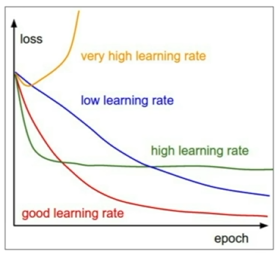
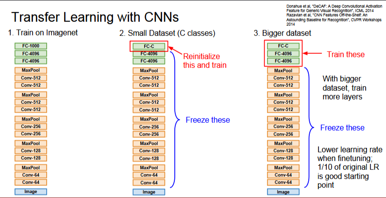
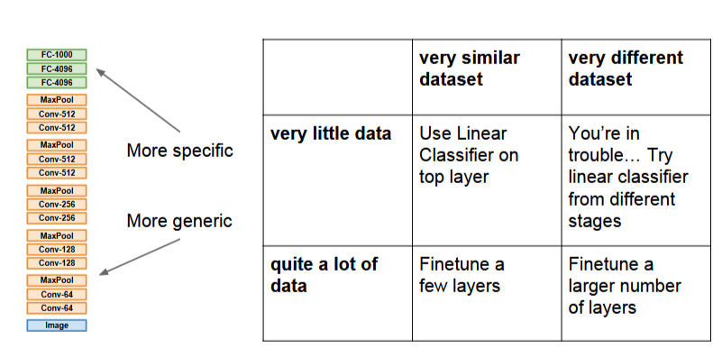

Completed Question1 and Question2 of Assignment 2!

# Training Neural Networks Part-2

## In Part2
- Fancier Optimization
- Regularization
- Transfer Learning

### Optimization: Problems with SGD?

Q:What if loss changes quickly in one direction and slowly in another? What does gradient descent do?

A: Very slow progress along shallow dimension, jitter along steep direction

Loss function has high condition number: ratio of largest to smallest singular value of the Hessian matrix is large

Q: What if the loss function has a local minima or saddle point?

A: SGD will get stuck, zero gradient, gradient descent gets stuck.

Saddle points are much more common in high dimension

Our gradients come from minibatches so they can be noisy!

In this casem if N is your whole training, then that could be something like a million, so each time computing the loss would be very expensive. So in practice we often estimate the loss and the gradient using a small mini batch of the gradient.

### SGD + Momentum, we can use this to overcome most of these problems!

### SGD
$$ x_{t+1} = x_t - \alpha\triangledown f(x_t) $$

```python
while True:
    dx = compute_gradient(x)
    x += learning_rate * dx
```

### SGD + Momentum
$$ v_{t+1} = \rho v_t + \triangledown f(x_t) $$
$$ x_{t+1} = x_t - \alpha v_{t+1} $$

```python
vx = 0
while True:
    dx = compute_gradient(x)
    vx = rho * vx + dx
    x += learning * vx
```

The idea is that we maintain a velocity overtime and we add our gradient estimates to the velocity and then we step in the direction of the velocity instead of the gradient.

### AdaGrad

```python
grad_squared = 0
while True:
    dx = compute_gradient(x)
    grad_squared += dx * dx
    x -= learning_rate * dx / (np.sqrt(grad_squared) + 1e-7)
```
Added element-wise scaling of the gradient based on the historical sum of squares in each dimension

### RMSProp

```python
grad_squared = 0
while True:
    dx = compute_gradient(x)
    grad_squared = decay_rate * grad_squared + (1 - decay_rate) * dx * dx
    x -= learning_rate * dx / (np.sqrt(grad_squared) + 1e-7)
```

### Adam

```python
first_moment = 0
second_moment = 0

while True:
    dx = compute_gradient(x)
    first_moment = beta1 * first_moment + (1 - beta1) * dx # Momentum
    second_moment = beta2 * second_moment + (1 - beta2) * dx * dx # AdaGrad/RMSProp
    x -= learning_rate * first_moment / (np.sqrt(second_moment) + 1e-7)
```
Sort of like RMSProp with momentum

Adam (Full Form)

```python
first_moment = 0
second_moment = 0

while True:
    dx = compute_gradient(x)
    first_moment = beta1 * first_moment + (1 - beta1) * dx # Momentum
    second_moment = beta2 * second_moment + (1 - beta2) * dx * dx
    
    # bias correction
    first unbias = first_moment / (1 - beta1 ** t)
    second_unbias = second_moment / (1 - beta2 ** t)

    # AdaGrad/RMSProp
    x -= learning_rate * first_unbias / (np.sqrt(second_unbias) + 1e-7)
```

Bias correction for the fact that first and second moment estimates start at zero

**Adam with beta1 = 0.9, beta2 = 0.999, and learning_rate = 1e-3 or 5e-4 is a great starting point for many models!**

SGD, SGD + Momentum, Adagrad, RMSProp, Adam all have leraning-rate as a hyperparameter!



Q: Which ones of these is the best learning rate?

It's not a rule to have 1 learning rate, we have decay the learning rate to get a curve.

=> Learning rate decay over time!

step decay:

eg. decay learning rate by half every few epochs

exponential decay: $ \alpha = \alpha_0 e^{-kt} $

1/t decay: $ \alpha = \alpha_0 / (1 + kt) $

learning rate decay more common in SGD and not that common in Adam

### In practice:
- Adam is a good default choice in most cases.
- If you can afford to do full batch updates then try out L-BFGS (and don't forget to disable all sources of noise)

### Model Ensembles
1. Train multiple independent models
2. At test time average their results

Enjoy 2% extra performance

Instead of training independent models, use multiple snapshots of a single model during training!

Instead of using actual parameter vector, keep a moving average of the parameter vector and use that at test time 
```python
while True:
    data_batch = dataset.sample_data_batch()
    loss = network.forward(data_batch)
    dx = network.backward()
    x += - learning_rate * dx
    x_test = 0.995 * x_test + 0.005 * x # use for test set
```
How to improve single-model performance?

Regularization!

It works like, we add something to our training data so that it doesn't learn very well on it but performs well on the testing data.

Regularization: Dropout

In each forward pass, randomly set some neurons to zero

Probability of dropping is a hyperparameter; 0.5 is common

```python
p = 0.5 # probability of keeping a unit active. Higher = less dropout

def train_step(X):
    # forward pass for example 3-layer neural network
    H1 = np.maximum(0, np.dot(W1, X) + b1)
    U1 = np.random.rand(*H1.shape) < p # first dropout mask
    H1 *= U1 # drop!

    H2 = np.maximum(0, np.dot(W2, H1) + b2)
    U2 = np.random.rand(*H2.shape) < p # second dropout mask
    H2 *= U2 # drop!

    out = np.dot(W3, H2) + b3

    # backward pass: compute gradient
    # perform parameter update

def predict(X):
    # ensembled forward pass
    H1 = np.maximum(0, np.dot(W1, X) + b1) * p # NOTE: scale the activations
    H2 = np.maximum(0, np.dot(W2, H1) + b2) * p # NOTE: scale the activations
    out = np.dot(W3, H3) + b3
```
## Transfer Learning

Basically take a big model and then add a layer, freeze other layers and train the model again



This is how to determine what to do wrt transfer learning


