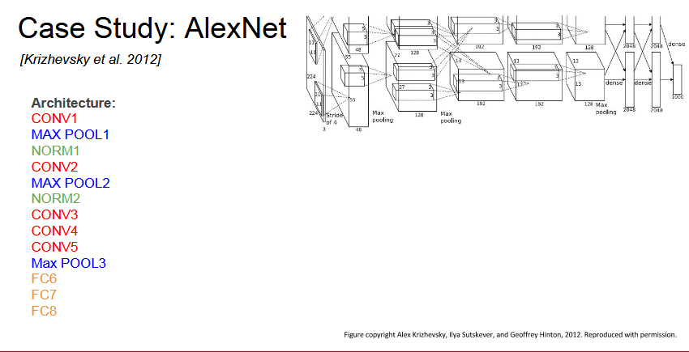
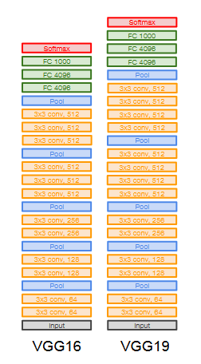
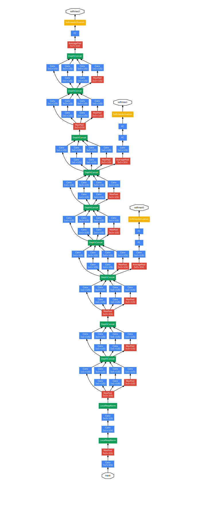
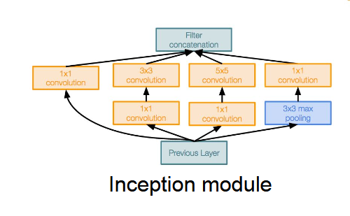
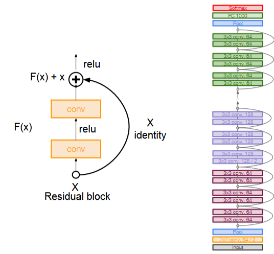
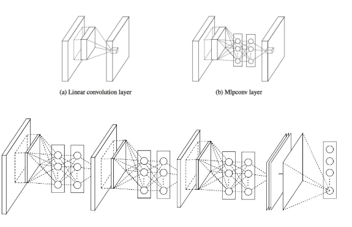

Completed Assignment 2, onto the the next ones

# CNN Architectures

## Case Studies
- AlexNet
- VGG
- GoogLeNet
- ResNet

### Also
- NiN (Network in Network)
- Wide ResNet
- ResNeXT
- Stochastic Depth
- DenseNet
- FractalNet
- SqueezeNet

### AlexNet

InputL 227x227x3

First layer (CONV1): 96 11x11 filters applied at stride 4

Q: What is the output volume size? Hint: (227-11)/4+1 = 55

A: Output volume: 55x55x96

Q: What is the total number of parameters in this layer?

A: Parameters: (11 * 11 * 3) * 96 = 35k

Second layer (POOL1): 3x3 filters applied at stride 2

Q: What is the output volume size? (55-3)/2+1 = 27

A: Output volume: 27x27x96

Q: What is the number of parameters in this layer?

A: 0! (Pooling layers has no parameters)

Full (simplified) AlexNet architecture:

- [227x227x3] INPUT
- [55x55x96] CONV1: 96 11x11 filters at stride 4, pad 0
- [27x27x96] MAX POOL1: 3x3 filters at stride 2
- [27x27x96] NORM1: Normalization layer
- [27x27x256] CONV2: 256 5x5 filters at stride 1, pad 2
- [13x13x256] MAX POOL2: 3x3 filters at stride 2
- [13x13x256] NORM2: Normalization layer
- [13x13x384] CONV3: 384 3x3 filters at stride 1, pad 1
- [13x13x384] CONV4: 384 3x3 filters at stride 1, pad 1
- [13x13x256] CONV5: 256 3x3 filters at stride 1, pad 1
- [6x6x256] MAX POOL3: 3x3 filters at stride 2
- [4096] FC6: 4096 neurons
- [4096] FC7: 4096 neurons
- [1000] FC8: 1000 neurons (class scores)

### Details/Retrospectives:
- first use of ReLU
- used Norm layers (not common anymore)
- heavy data augmentation
- dropout 0.5
- batch size 128
- SGD Momentum 0.9
- Learning rate 1e-2, reduced by 10
manually when val accuracy plateaus
- L2 weight decay 5e-4
- 7 CNN ensemble: 18.2% -> 15.4%

Historical Note: Trained on GTX 580 GPU with only 3 GB of memory. Network spead across 2 GPUs, half neurons (feature maps) on each GPU.

### VGGNet

Small filters, Deeper networks

8 layers (AlexNet)

-> 16-19 layers

Only 3x3 Conv stride 1, pad 1 and 2x2 MAX POOL stride 2

Q: Why use small filters? (3x3 conv)

A: This helps the network generalize to classification problems beyond it's original training data. Stacking two 3x3 convolutional layers gives a receptive field of 5, equivalent to one 5x5 convolutional layer. Using smaller 3x3 filters can also reduce the number of parameters.

VGG16

- INPUT: [224x224x3] memory: 224 * 224 * 3=150K params: 0
- CONV3-64: [224x224x64] memory: 224 * 224 * 64=3.2M params: (3 * 3 * 3) * 64 = 1,728
- CONV3-64: [224x224x64] memory: 224 * 224 * 64=3.2M params: (3 * 3 * 64) * 64 = 36,864
- POOL2: [112x112x64] memory: 112 * 112 * 64=800K params: 0
- CONV3-128: [112x112x128] memory: 112 * 112 * 128=1.6M params: (3 * 3 * 64) * 128 = 73,728
- CONV3-128: [112x112x128] memory: 112 * 112 * 128=1.6M params: (3 * 3 * 128) * 128 = 147,456
- POOL2: [56x56x128] memory: 56 * 56 * 128=400K params: 0
- CONV3-256: [56x56x256] memory: 56 * 56 * 256=800K params: (3 * 3 * 128) * 256 = 294,912
- CONV3-256: [56x56x256] memory: 56 * 56 * 256=800K params: (3 * 3 * 256) * 256 = 589,824
- CONV3-256: [56x56x256] memory: 56 * 56 * 256=800K params: (3 * 3 * 256) * 256 = 589,824
- POOL2: [28x28x256] memory: 28 * 28 * 256=200K params: 0
- CONV3-512: [28x28x512] memory: 28 * 28 * 512=400K params: (3 * 3 * 256) * 512 = 1,179,648
- CONV3-512: [28x28x512] memory: 28 * 28 * 512=400K params: (3 * 3 * 512) * 512 = 2,359,296
- CONV3-512: [28x28x512] memory: 28 * 28 * 512=400K params: (3 * 3 * 512) * 512 = 2,359,296
- POOL2: [14x14x512] memory: 14 * 14 * 512=100K params: 0
- CONV3-512: [14x14x512] memory: 14 * 14 * 512=100K params: (3 * 3 * 512) * 512 = 2,359,296
- CONV3-512: [14x14x512] memory: 14 * 14 * 512=100K params: (3 * 3 * 512) * 512 = 2,359,296
- CONV3-512: [14x14x512] memory: 14 * 14 * 512=100K params: (3 * 3 * 512) * 512 = 2,359,296
- POOL2: [7x7x512] memory: 7 * 7 * 512=25K params: 0
- FC: [1x1x4096] memory: 4096 params: 7 * 7 * 512 * 4096 = 102,760,448
- FC: [1x1x4096] memory: 4096 params: 4096 * 4096 = 16,777,216
- FC: [1x1x1000] memory: 1000 params: 4096 * 1000 = 4,096,000

Total memory: 24M * 4 bytes ~= 96MB/image (only forward ~*2 for bwd)

Total params: 138M parameters

### GoogLeNet

Deeper networks, with computational efficiency.

- 22 layers
- Efficient “Inception” module
- No FC layers
- Only 5 million parameters! 12x less than AlexNet
- ILSVRC’14 classification winner (6.7% top 5 error)

"Inception Module": desgin a good local network topology (network within a network) and then stack these modules on top of each other.

Apply parallel filter operations on the input from previous layer:
- Multiple receptive field sizes for convolution (1x1, 3x3, 5x5)
- Pooling opertaion (3x3)

Concatenate all filter outputs together depth-wise

22 total layers with weights (including each parallel layer in an inception module)

### ResNet

Very deep networks using residual connections.

- 152-layer model for ImageNet
- ILSVRC’15 classification winner (3.57% top 5 error)
- Swept all classification and detection competitions in ILSVRC’15 and COCO’15!

Full ResNet architecture
- stack residual blocks
- Every residual block as has two 3x3 conv layers
- Periodically, double of # of filters and downsample spatially using stride 2 (/2 in each dimension)
- Additionally conv layer at beginning
- No FC layers at the end (only FC 1000 to output classes)

#### Training ResNet in practice:
- Batch Normalization after every CONV layer
- Xavier/2 initialization from He et al.
- SGD + momentum (0.9)
- Learning rate: 0.1, divided by 10 when validation error plateaus
- Mini-batch size 256
- Weight decay of 1e-5
- No dropout used

### NiN (Network in Network)

- Mlpconv layer with "micronetwork" within each conv layer to compute more abstract features for local patches
- Micronetwork uses multilayer perceptron (FC ie 1x1 conv layers)
- Precurosr to GoogLeNet and ResNet "bottleneck" layers
- Philosophical inspiration for GoogLeNet

## Summary: CNN Architectures
- VGG, GoogLeNet, ResNet all in wide use, available in model zoos
- ResNet current best default
- Trend towards extremely deep networks
- Significant research centers around design of layer / skip connections and improving gradient flow
- Even more recent trend towards examining necessity of depth vs.
width and residual connections